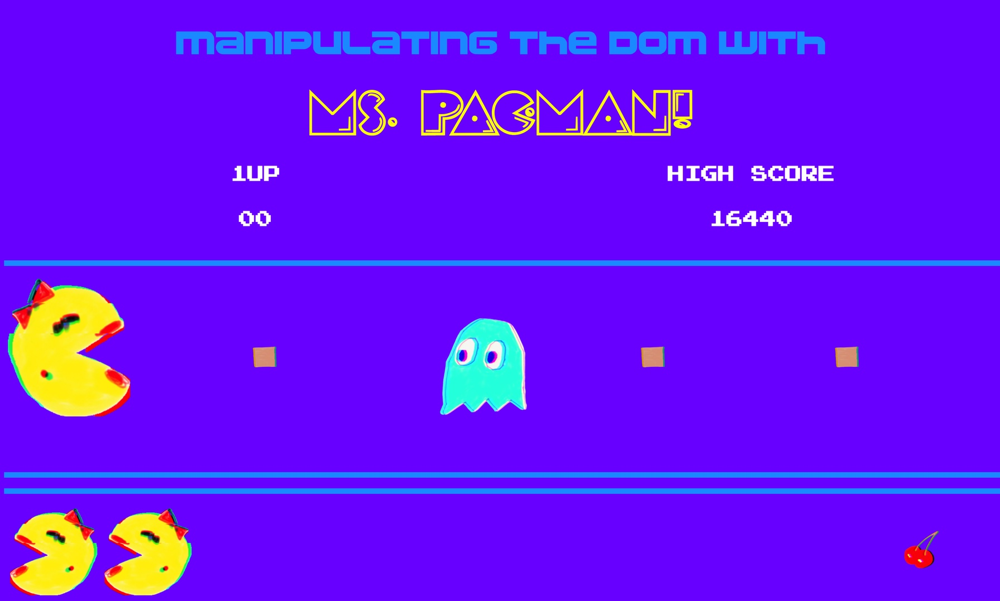

<h1 align="center">Welcome to ms-pac-man 👋</h1>
  <a href="https://thewalkingduff.github.io/ms-pac-man/">
    
  </a>
<p>
  <a href="https://twitter.com/duffManCode" target="_blank">
    
  </a>
</p>

> Click Ms. Pac-Man and watch her eat food and Inky. DOM manipulation and logic to make her turn around at the edge of the screen.

### 🏠 [Homepage](https://thewalkingduff.github.io/ms-pac-man/)

### ✨ [Demo](https://thewalkingduff.github.io/ms-pac-man/)

## Usage

```sh
Click Ms. Pac-Man to make her move!  That's it for now. Updates to come!!
```

<!-- ROADMAP -->

## Roadmap

I will be updating it to have the food totally disappear after she eats it.  When she gets to the other side all the food and Inky the ghost will reappear so she can go back and eat them again.
Someday I would like to revamp the whole site and make something close to the real Ms. Pac-Man game with my own custom funky art.  No quarters will be needed to play. 😉

## Contributing

Contributions are what make the open source community such an amazing place to be learn, inspire, and create. Any contributions you make are **greatly appreciated**.

1. Fork the Project
2. Create your Feature Branch (`git checkout -b feature/AmazingFeature`)
3. Commit your Changes (`git commit -m 'Add some AmazingFeature'`)
4. Push to the Branch (`git push origin feature/AmazingFeature`)
5. Open a Pull Request

## License

Distributed under the MIT License. See `LICENSE` for more information.

## Author

👤 **Brendan Duffy**

* Website: www.webdevduffy.com
* Twitter: [@duffManCode](https://twitter.com/duffManCode)
* Github: [@thewalkingduff](https://github.com/thewalkingduff)
* LinkedIn: [@devduffy](https://linkedin.com/in/devduffy)

## Show your support

Give a ⭐️ if this project helped you!

***
_This README was generated with ❤️ by [readme-md-generator](https://github.com/kefranabg/readme-md-generator)_